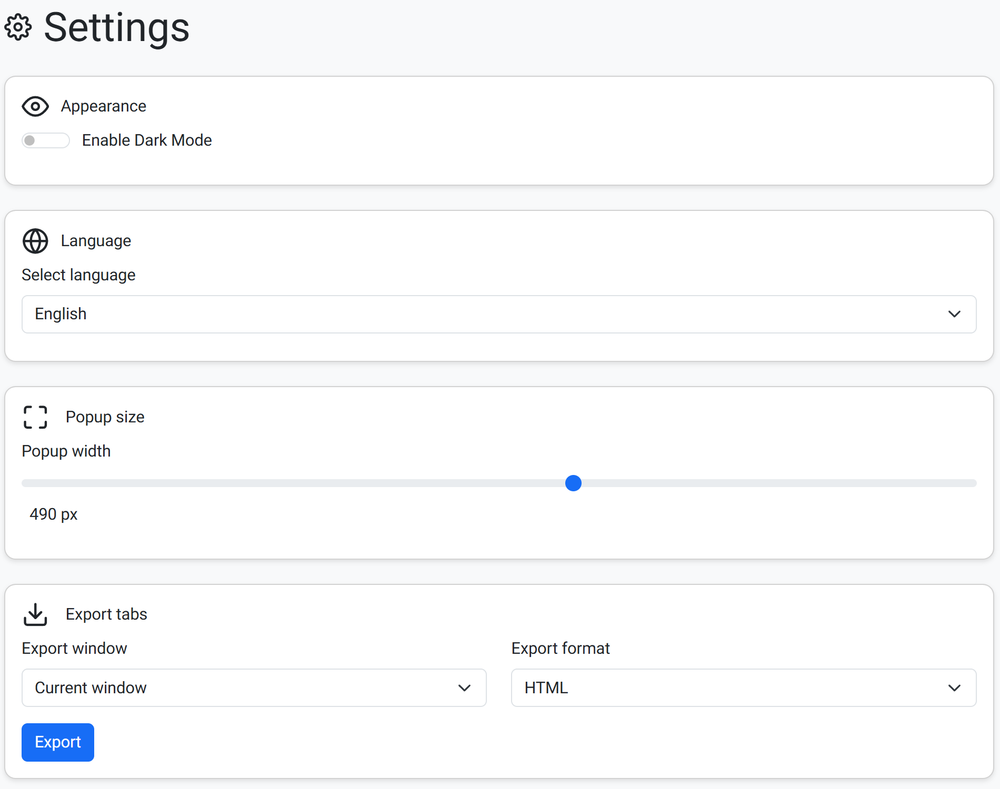
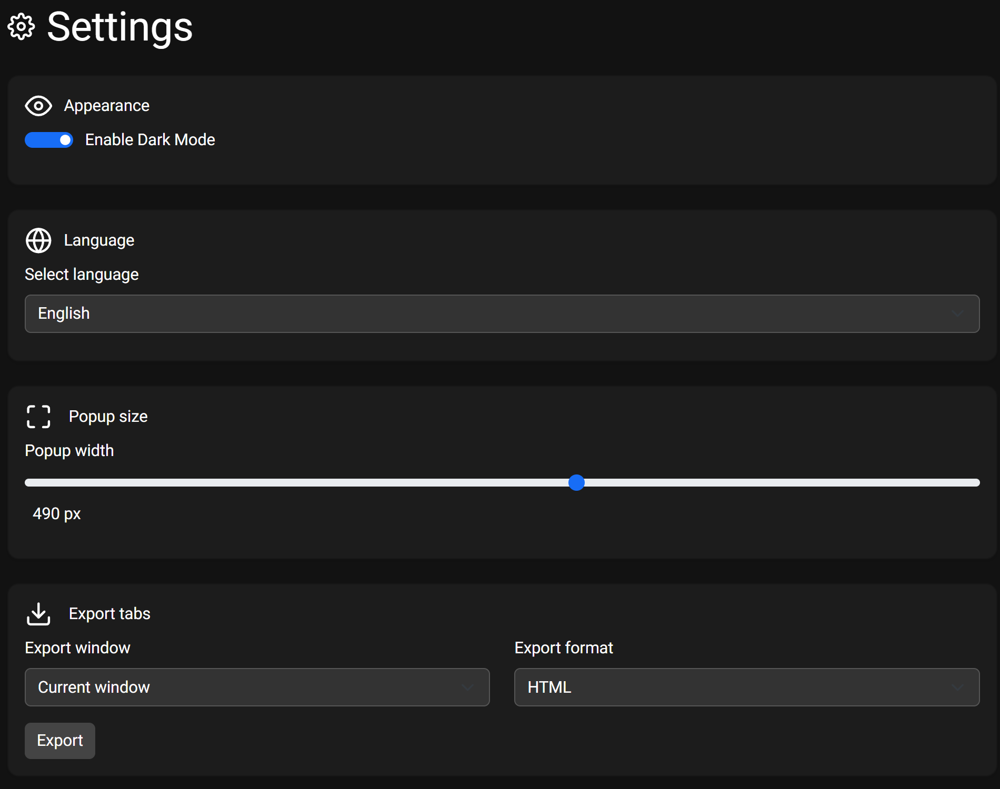
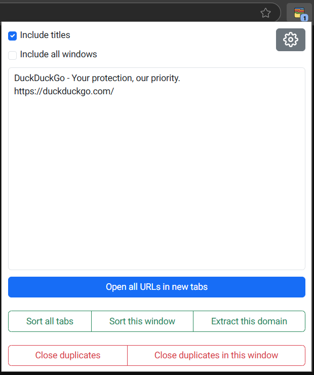
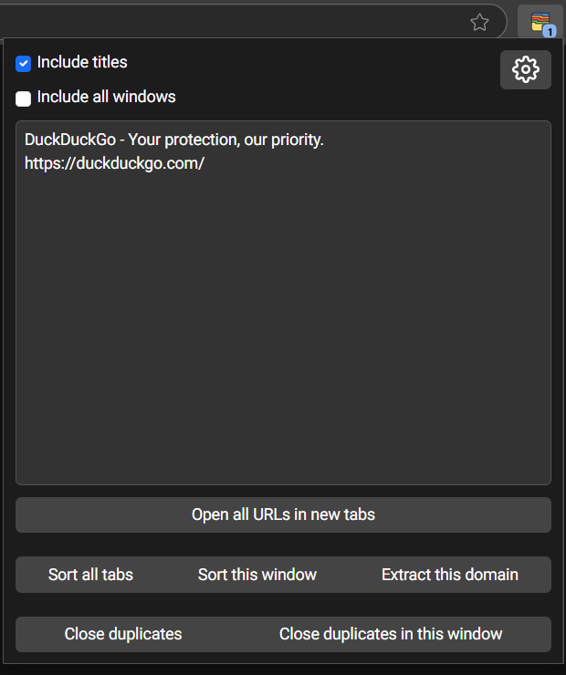

<div style="display: flex; align-items: center; justify-content: center;">
  
  <h1 style="margin-left: 30px;">ZenTabs - Tab Manager</h1>
</div>

ZenTabs is a Manifest V3 compatible Chrome extension designed to organize your browsing experience. It allows you to export and import tab URLs, sort and manage them across multiple windows, and close duplicate tabs.

## Features

- **Tabs Counter**: Displays the number of open tabs.
- **Export Tabs**: Export the URLs of your open tabs to a text area.
- **Import Tabs**: Open URLs from the text area in new tabs.
- **Sort Tabs**: Sort tabs within a window or across all windows.
- **Close Duplicate Tabs**: Identify and close duplicate tabs within a window or across all windows.

## Settings

- **Dark Mode Toggle**: Switch between light and dark themes to suit your preference.
- **Localization Support**: Choose your preferred language for an improved user experience.
- **Tabs Export Options**: Export your tabs from all windows or the current window in HTML, CSV, or JSON formats.

## Installation

1. Clone the repository:
    ```sh
    git clone https://github.com/wjakubowicz/zentabs.git
    ```
2. Open Chrome and navigate to [`chrome://extensions/`](chrome://extensions/).
3. Enable "Developer mode" by toggling the switch in the top right corner.
4. Click on "Load unpacked" and select the cloned repository folder.

## Usage

1. Click the ZenTabs icon in the Chrome toolbar to open the popup.
2. Click the **Settings** button to customize the extension.
3. Use the checkboxes to include titles and/or all windows when exporting tabs.
4. Click **"Open All URLs in New Tabs"** to open the URLs listed in the text area.
5. Use the buttons to perform actions such as:
    - **Sort All Tabs**: Sorts tabs across all windows.
    - **Sort This Window**: Sorts tabs within the current window.
    - **Extract This Domain**: Extracts all tabs with the same domain as the active tab into a new window and sorts them.
    - **Close Duplicates**: Closes duplicate tabs in all windows.
    - **Close Duplicates in This Window**: Closes duplicate tabs in the current window.

## Contributing

Contributions are welcome! Please open an issue or submit a pull request with your changes.

## Screenshots

<div align="center">
  <div style="display: inline-block; margin: 10px;">
    
    
  </div>
  <div style="display: inline-block; margin: 10px;">
    
    
  </div>
</div>

---

Enjoy a more organized browsing experience with ZenTabs!