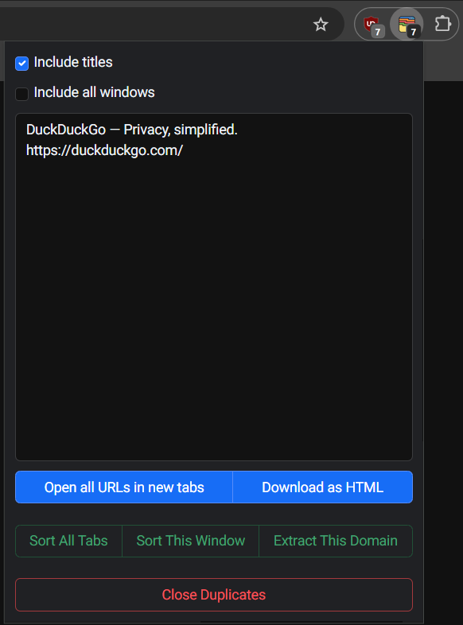

# ZenTabs - Tab Manager

ZenTabs is a Manifest V3 compatible Chrome extension designed to organize your browsing experience.
It allows exporting and importing URLs of tabs to text, sorting and managing them across multiple windows and closing duplicates.

## Features

- **Tabs Counter**: Display the number of open tabs.
- **Export Tabs**: Export the URLs of your open tabs to a text area.
- **Import Tabs**: Open URLs from the text area in new tabs.
- **Sort Tabs**: Sort tabs within a window or across all windows.
- **Close Duplicate Tabs**: Identify and close duplicate tabs.
- **Download as HTML**: Download the list of URLs as an HTML file with clickable links.

## Settings
- **Dark Mode Toggle**: Switch between light and dark themes to suit your preference.
- **Localization Support**: Choose your preferred language for an improved user experience.

## Installation

1. Clone the repository:
    ```sh
    git clone https://github.com/wjakubowicz/zentabs.git
    ```
2. Open Chrome and navigate to [`chrome://extensions/`](chrome://extensions/).
3. Enable "Developer mode" by toggling the switch in the top right corner.
4. Click on "Load unpacked" and select the cloned repository folder.

## Usage

1. Click on the ZenTabs icon in the Chrome toolbar to open the popup.
2. Use the checkboxes to include titles and/or all windows when exporting tabs.
3. Click "Open all URLs in new tabs" to open the URLs listed in the text area.
4. Click "Download as HTML" to download the URLs as an HTML file.
5. Use the buttons to sort tabs or close duplicate tabs:
    - **Sort All Tabs**: Sorts tabs across all windows.
    - **Sort This Window**: Sorts tabs within the current window.
    - **Extract This Domain**: Extracts all tabs with the same domain as the active tab into a new window and sorts them.
    - **Close Duplicates**: Closes duplicate tabs.

## Permissions

The extension requires the following permissions:
- **tabs**: To access and manage browser tabs.
- **activeTab**: To interact with the currently active tab.
- **scripting**: To execute scripts in the context of web pages.

## Contributing

Contributions are welcome! Please open an issue or submit a pull request with your changes.

---

<p align="center">
  
</p>

---

Enjoy a more organized browsing experience with ZenTabs!